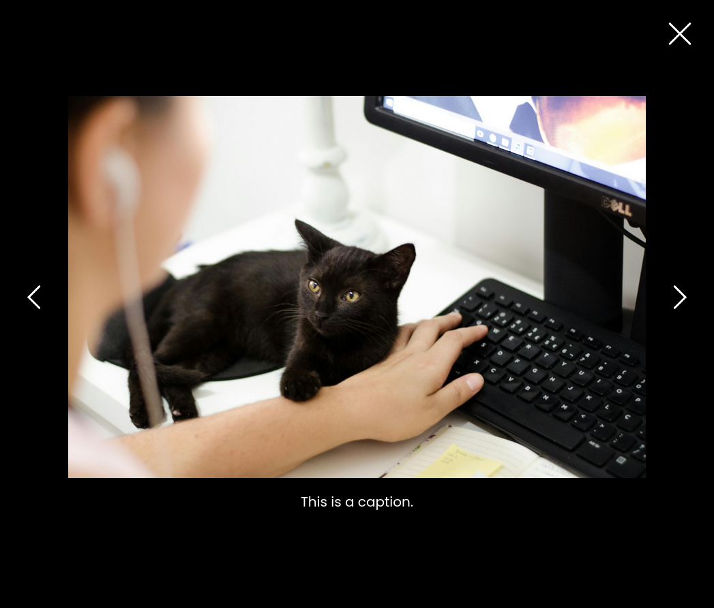

# Lightbox Gallery Block for Wordpress

A simple Lightbox Gallery block for Gutenberg, with full keyboard functionality.

Images are displayed in a grid, with 4 or 2 images per row depending on device width.

Clicking an image opens it in a simple lightbox with a black transparent overlay, caption, and possible actions:
* Press right arrow key or 'Next' button to show next image.
* Press left arrow key or 'Previous' button to show previous image.
* Press esc key, 'Close' button, or click lightbox background to close and restore focus to the matching image link.

